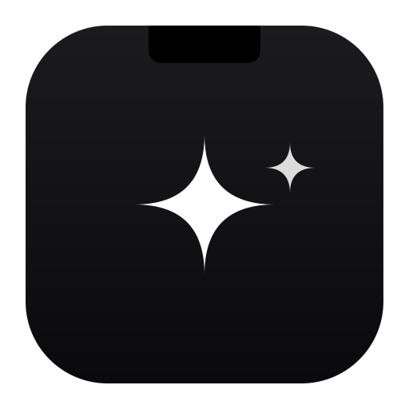
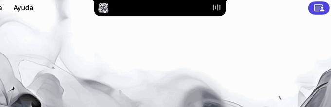

<h1 align="center">
  <br>
  
  <br>
  AgenticNotch
  <br>
</h1>

<p align="center">
  <em>Turn your MacBook's notch into a live monitor for your AI coding agents.</em>
</p>

<p align="center">
  <a href="https://github.com/lucasscurtoo/AgenticNotch/releases/latest/download/AgenticNotch.dmg">
    
  </a>
</p>

<p align="center">
  <a href="https://github.com/lucasscurtoo/AgenticNotch/releases/latest"></a>
  
  
</p>

<p align="center">
  
</p>

**AgenticNotch** pops a card out of the notch — tool · summary · project · status — and
plays a chime whenever **Claude Code** or **Codex** finishes a turn, so you can stop
babysitting the terminal. It keeps a history of the last runs, and still does everything
the notch did before: music controls, calendar, file shelf and HUD replacement.

### Features

- 🔔 **Agent-finished notifications** — when Claude Code or Codex ends a turn, the notch
  pops a card with a short summary of *what it did*, the project, and an ok/error status.
- 🕑 **History** — the last 10 runs, in a dedicated notch tab and in Settings.
- 📊 **AI limits tab** *(experimental)* — reads local Claude/Codex credentials to show
  session usage. Works only where those tokens are locally readable.
- 🎧 **Everything else the notch already did** — music live activity, calendar, shelf with
  AirDrop, HUD replacement for volume/brightness/backlight.

## Install

**Requirements:** macOS 14 Sonoma or later · Apple Silicon or Intel.

### Option 1 — download the DMG

[**Download AgenticNotch.dmg**](https://github.com/lucasscurtoo/AgenticNotch/releases/latest/download/AgenticNotch.dmg)
(always the latest release), open it and drag **AgenticNotch** to `/Applications`.

> [!IMPORTANT]
> The app is signed with a free Apple Development certificate, not notarized (that needs a
> paid Apple Developer account), so macOS will refuse to open it on first launch. One
> command, once:
>
> ```bash
> xattr -dr com.apple.quarantine /Applications/AgenticNotch.app
> ```
>
> Then open it normally. Alternative without Terminal: **System Settings → Privacy &
> Security → Open Anyway**, right after the first failed launch.

### Option 2 — build from source

```bash
git clone https://github.com/lucasscurtoo/AgenticNotch.git
cd AgenticNotch
./scripts/build-release-dmg.sh     # builds, signs with your Apple Development cert, makes a DMG
```

Or open `boringNotch.xcodeproj` in Xcode and hit **Run**. If you build a *Release* config
from Xcode without setting your signing team, the app will crash at launch with
`Library not loaded: @rpath/MediaRemoteAdapter.framework` — the bundled framework and the
app end up with different Team IDs under hardened runtime. Set your team in **Signing &
Capabilities**, or just use the script above.

## Wiring your agents

The notch reacts when a CLI agent finishes a turn. Configure the sound and behaviour under
**Settings → Agents**, and point your agent at the bundled script (absolute path):

**Claude Code** — `~/.claude/settings.json`:
```json
{
  "hooks": {
    "Stop": [
      { "hooks": [ { "type": "command",
        "command": "/absolute/path/to/AgenticNotch/scripts/agenticnotch-notify --tool claude --status ok" } ] }
    ]
  }
}
```
The summary is derived from the last assistant message; `project` defaults to the basename
of the hook's working directory.

**Codex** — `~/.codex/config.toml`:
```toml
notify = ["/absolute/path/to/AgenticNotch/scripts/agenticnotch-notify", "--tool", "codex", "--status", "ok"]
```
Codex appends a JSON event payload as a trailing argument; the script ignores it.

## Usage

- Hover over the notch to expand it: music, calendar, shelf, agent history.
- Click the icon in the menu bar to open Settings and customize everything.

## 📋 Roadmap

- [x] Agent-finished notifications for Claude Code and Codex 🔔
- [x] Run history 🕑
- [ ] Per-project filters and mute rules 🔕
- [ ] More agents (Gemini CLI, Cursor, Aider) 🤖
- [ ] Live "agent is working" state, not just finished 🔄
- [ ] Own appcast so the app can auto-update ⬆️

## 🤝 Contributing

Contributions welcome — see [CONTRIBUTING.md](CONTRIBUTING.md).

## 🎉 Credits

AgenticNotch is a fork of **[boring.notch](https://github.com/TheBoredTeam/boring.notch)**
by [TheBoringTeam](https://github.com/TheBoredTeam) (GPL-3.0) — the music, calendar, shelf
and HUD features are their work; this fork adds the AI-agent layer on top. Go star the
original: [Discord](https://discord.gg/GvYcYpAKTu) · [Ko-fi](https://www.ko-fi.com/alexander5015).

Also built on **[MediaRemoteAdapter](https://github.com/ungive/mediaremote-adapter)** (Now
Playing on macOS 15.4+) and **[NotchDrop](https://github.com/Lakr233/NotchDrop)** (basis for
the Shelf). Original icon by [@maxtron95](https://github.com/maxtron95).
Full attributions: [Third-Party Licenses](./THIRD_PARTY_LICENSES).
